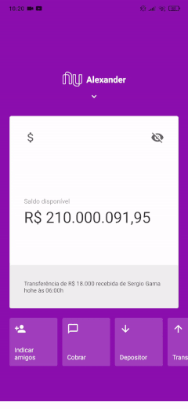

<h1 align="center">Nubank Cloning</h1>
<p align="center">
Este aplicativo foi realizado com o objetivo de aprender um pouco da biblioteca de Animações do React Native na prática.
</p>

<h3 align="center"> 
  
</h3>

## Funcionalidades
A aplicação conta com algumas funcionalidades implementadas:
- [X] Tela inicial do Nubank
- [X] Animação de arrastar
- [X] Animação de Scroll

## Tecnologias
As seguintes ferramentas foram utilizadas na construção do projeto:
- [JavaScript](https://www.javascript.com/)
- [VSCode](https://code.visualstudio.com/)
- [Node.Js](https://nodejs.org/)
- [React Native](https://reactnative.dev/)
- [Expo (Bare Workflow)](https://github.com/expo/create-react-native-app)

## Como utilizar? 

### Clone
- Clone este repositório na sua máquina local
```
git clone https://github.com/alexanderaugusto/nubank-app-clone.git
```

### Run
- Na pasta do projeto, rode o comando no seu terminal para instalar o aplicativo:

  #### Android:
  ```sh
  yarn run-android ou npm run-android 
  ```
  #### IOS: 
  ```sh
  yarn run-ios ou npm run-ios 
  ```

OBS: Se você já instalou o aplicativo no seu dispositivo uma vez e deseja rodar novamente, basta executar o comando yarn start ou npm start, para apenas iniciar o aplicativo e não instalá-lo novamente. Porém, isso só vale se você não instalou nenhuma dependência que modifique as pastas Android e IOS.